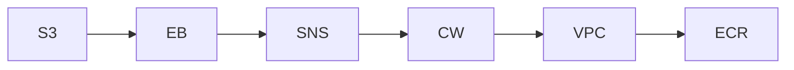

# InfraTales | AWS CDK EC2 CodeDeploy Pipeline: ALB and Auto Scaling Without the 2am 502s

**AWS CDK (TYPESCRIPT) reference architecture — CI/CD pillar | advanced level**

> Your team needs to ship a web application to EC2 with a repeatable, auditable deployment pipeline — but stitching together CodePipeline, CodeDeploy, Auto Scaling, and an ALB in CDK without blowing up IAM permissions or missing CloudWatch alarms is exactly the kind of work that takes three days and two rollbacks to get right. The missing piece is usually not the compute — it's the operational glue: SSM parameters for config, SNS for deploy notifications, EventBridge for pipeline state changes, and log retention that doesn't quietly rack up cost. This architecture solves the 'we need a production-grade EC2 deployment setup, not a tutorial skeleton' problem.

[](LICENSE)
[](CONTRIBUTING.md)
[](https://aws.amazon.com/)
[-IaC-purple.svg)](https://aws.amazon.com/cdk/)
[](https://infratales.com/p/8949110c-3c35-430c-a52e-b890505ba9fb/)
[](https://infratales.com)


## 📋 Table of Contents

- [Overview](#-overview)
- [Architecture](#-architecture)
- [Key Design Decisions](#-key-design-decisions)
- [Getting Started](#-getting-started)
- [Deployment](#-deployment)
- [Docs](#-docs)
- [Full Guide](#-full-guide-on-infratales)
- [License](#-license)

---

## 🎯 Overview

The stack builds a custom VPC with public and private subnets, places an Application Load Balancer in the public tier, and runs an Auto Scaling Group of EC2 instances in the private tier — a standard layered model [editorial]. What ties it together operationally is the CI/CD spine: S3 as the artifact store, CodePipeline orchestrating source-to-deploy, CodeBuild for the build stage, and CodeDeploy handling rolling deploys onto the ASG [from-code]. SSM Parameter Store carries runtime config so EC2 instances never bake secrets into AMIs [editorial], SNS handles deployment event notifications, and EventBridge routes pipeline state changes to downstream consumers [from-code]. CloudWatch with structured log groups and alarms closes the observability loop — meaning the architecture ships with at least a baseline on-call story rather than silent failures [inferred].

**Pillar:** CI/CD — part of the [InfraTales AWS Reference Architecture series](https://infratales.com).
**Target audience:** advanced cloud and DevOps engineers building production AWS infrastructure.

---

## 🏗️ Architecture



> 📐 See [`diagrams/`](diagrams/) for full architecture, sequence, and data flow diagrams.

> Architecture diagrams in [`diagrams/`](diagrams/) show the full service topology (architecture, sequence, and data flow).
> The [`docs/architecture.md`](docs/architecture.md) file covers component responsibilities and data flow.

---

## 🔑 Key Design Decisions

- CodeDeploy on EC2 with Auto Scaling gives zero-downtime rolling deploys without ECS/EKS overhead, but the deployment lifecycle hooks (BeforeInstall, AfterInstall, ApplicationStart) add 5–15 minutes to deploy time versus a container swap — a real cost for teams doing more than ten deploys per day [inferred].
- Storing artifacts in S3 instead of ECR keeps the pipeline simple but ties you to zip-based deployments; you lose layer caching and immutable image semantics that container-based pipelines provide [editorial].
- SSM Parameter Store standard tier is free up to 10,000 parameters but moves to $0.05 per parameter per month on advanced tier — teams inadvertently hit limits and see cryptic TooManyUpdates errors during deploys [inferred].
- An ALB in front of an ASG means health check misconfiguration (wrong path, wrong threshold) will silently drain all instances during a deploy — there is no built-in CDK guard against this and it is the most common 2am incident for this pattern [editorial].
- CloudWatch log retention defaulting to never-expire is a cost trap — a busy EC2 fleet can accumulate $50–200 per month in CloudWatch Logs storage alone if retention is not explicitly set per log group [inferred].

> For the full reasoning behind each decision — cost models, alternatives considered, and what breaks at scale — see the **[Full Guide on InfraTales](https://infratales.com/p/8949110c-3c35-430c-a52e-b890505ba9fb/)**.

---

## 🚀 Getting Started

### Prerequisites

```bash
node >= 18
npm >= 9
aws-cdk >= 2.x
AWS CLI configured with appropriate permissions
```

### Install

```bash
git clone https://github.com/InfraTales/<repo-name>.git
cd <repo-name>
npm install
```

### Bootstrap (first time per account/region)

```bash
cdk bootstrap aws://YOUR_ACCOUNT_ID/YOUR_REGION
```

---

## 📦 Deployment

```bash
# Review what will be created
cdk diff --context env=dev

# Deploy to dev
cdk deploy --context env=dev

# Deploy to production (requires broadening approval)
cdk deploy --context env=prod --require-approval broadening
```

> ⚠️ Always run `cdk diff` before deploying to production. Review all IAM and security group changes.

---

## 📂 Docs

| Document | Description |
|---|---|
| [Architecture](docs/architecture.md) | System design, component responsibilities, data flow |
| [Runbook](docs/runbook.md) | Operational runbook for on-call engineers |
| [Cost Model](docs/cost.md) | Cost breakdown by component and environment (₹) |
| [Security](docs/security.md) | Security controls, IAM boundaries, compliance notes |
| [Troubleshooting](docs/troubleshooting.md) | Common issues and fixes |

---

## 📖 Full Guide on InfraTales

This repo contains **sanitized reference code**. The full production guide covers:

- Complete AWS CDK (TYPESCRIPT) stack walkthrough with annotated code
- Step-by-step deployment sequence with validation checkpoints
- Edge cases and failure modes — what breaks in production and why
- Cost breakdown by component and environment
- Alternatives considered and the exact reasons they were ruled out
- Post-deploy validation checklist

**→ [Read the Full Production Guide on InfraTales](https://infratales.com/p/8949110c-3c35-430c-a52e-b890505ba9fb/)**

---

## 🤝 Contributing

See [CONTRIBUTING.md](CONTRIBUTING.md) for guidelines. Issues and PRs welcome.

## 🔒 Security

See [SECURITY.md](SECURITY.md) for our security policy and how to report vulnerabilities responsibly.

## 📄 License

See [LICENSE](LICENSE) for terms. Source code is provided for reference and learning.

---

<p align="center">
  Built by <a href="https://infratales.com">InfraTales</a> — Production AWS Architecture for Engineers Who Build Real Systems
</p>
